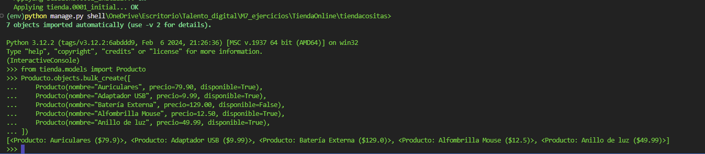
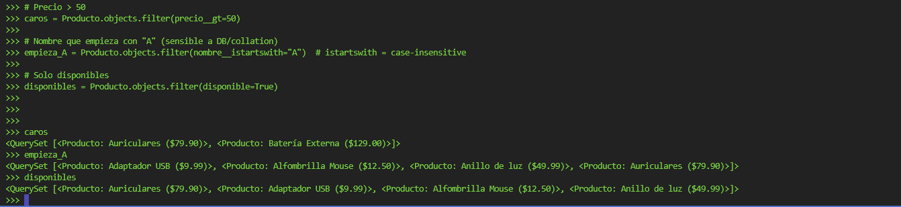
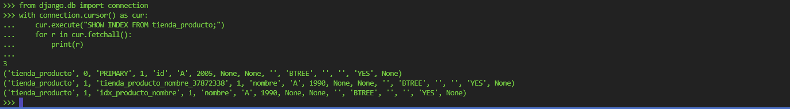
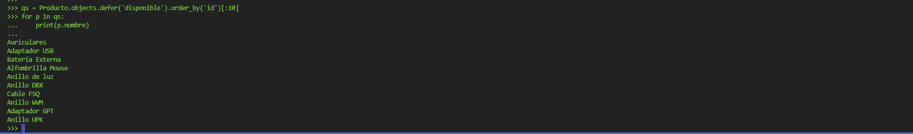
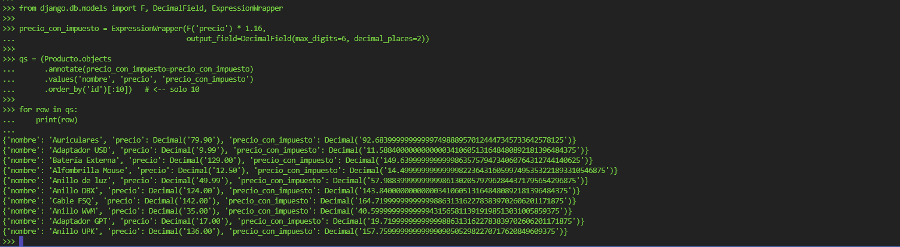
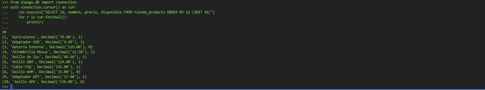
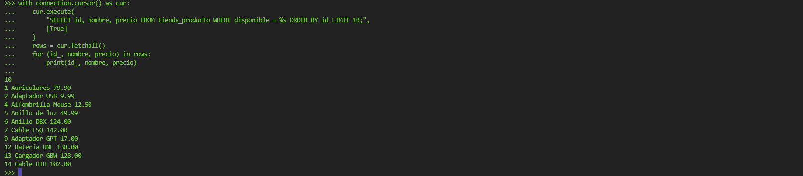
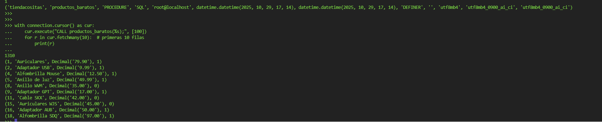

# 🛍️ TiendaOnline - Ejercicio Individual (Django ORM, SQL y Procedimientos)

Proyecto desarrollado como parte del módulo M7 del Bootcamp *Talento Digital*, donde se aplican consultas ORM, SQL, procedimientos almacenados y operaciones avanzadas en Django.

---

## 📚 Contenido del Proyecto

**Estructura de carpetas:**


TiendaOnline/
├── manage.py
├── tiendacositas/
│ ├── settings.py
│ ├── urls.py
│ ├── wsgi.py
│ └── init.py
├── tienda/
│ ├── models.py
│ ├── views.py
│ ├── admin.py
│ ├── migrations/
│ └── tests.py
└── .gitignore


---

## Instalación y Configuración

1️⃣ Crear entorno virtual e instalar dependencias
```bash
python -m venv env
env\Scripts\activate
pip install django pymysql
```

2️⃣ Configurar conexión a MySQL (settings.py)
```bash
DATABASES = {
    'default': {
        'ENGINE': 'django.db.backends.mysql',
        'NAME': 'tiendacositas',
        'USER': 'root',
        'PASSWORD': 'tu_contraseña',
        'HOST': 'localhost',
        'PORT': '3306',
    }
}
```

3️⃣ Hook para PyMySQL (en __init__.py)
```bash
import pymysql
pymysql.install_as_MySQLdb()
```

4️⃣ Migrar base de datos
```bash
python manage.py makemigrations
python manage.py migrate
```

1) Modelo Producto
```bash
class Producto(models.Model):
    nombre = models.CharField(max_length=100, db_index=True)
    precio = models.DecimalField(max_digits=5, decimal_places=2)
    disponible = models.BooleanField(default=True)

    def __str__(self):
        return f"{self.nombre} (${self.precio})"

```
2) Recuperación y filtros ORM

Consulta general y filtros:
```bash
todos = Producto.objects.all()
caros = Producto.objects.filter(precio__gt=50)
empieza_A = Producto.objects.filter(nombre__istartswith="A")
disponibles = Producto.objects.filter(disponible=True)
```





3) Consultas SQL con raw()
```bash
q = Producto.objects.raw("SELECT id, nombre, precio FROM tienda_producto WHERE precio < 100;")
for p in q:
    print(p.nombre, p.precio)
```
.png)

4) Índices en Django

Definición:
```bash
nombre = models.CharField(max_length=100, db_index=True)

Verificación del índice:
from django.db import connection
with connection.cursor() as cur:
    cur.execute("SHOW INDEX FROM tienda_producto;")
    print(cur.fetchall())
```



Comprobación de eficiencia (EXPLAIN):
```bash
qs = Producto.objects.filter(nombre__gte='A', nombre__lt='B')
print(qs.explain())
```


 6) Exclusión de campos
```bash
qs = Producto.objects.defer('disponible').order_by('id')[:10]
for p in qs:
    print(p.nombre)
```


 7) Anotaciones (annotate())
```bash
from django.db.models import F, DecimalField, ExpressionWrapper
precio_con_impuesto = ExpressionWrapper(F('precio') * 1.16, output_field=DecimalField(max_digits=6, decimal_places=2))
qs = Producto.objects.annotate(precio_con_impuesto=precio_con_impuesto).values('nombre', 'precio', 'precio_con_impuesto')[:10]
for row in qs:
    print(row)
```



 8) raw() con parámetros
```bash
limite = 100
q = Producto.objects.raw(
    "SELECT id, nombre, precio, disponible FROM tienda_producto WHERE precio < %s LIMIT 10;", [limite]
)
for p in q:
    print(p.nombre, p.precio)
```
.png)


 9) SQL directo (connection.cursor())
```bash
from django.db import connection
with connection.cursor() as cur:
    cur.execute("UPDATE tienda_producto SET disponible = %s WHERE nombre = %s;", [False, "Cable HDMI"])
```



10) Cursores manuales
```bash
with connection.cursor() as cur:
    cur.execute("SELECT id, nombre, precio FROM tienda_producto WHERE disponible = %s ORDER BY id LIMIT 10;", [True])
    rows = cur.fetchall()
    for (id_, nombre, precio) in rows:
        print(id_, nombre, precio)
```


11) Procedimientos almacenados

Creación (MySQL):
```bash
CREATE PROCEDURE productos_baratos(IN max_precio DECIMAL(5,2))
BEGIN
    SELECT id, nombre, precio, disponible
    FROM tienda_producto
    WHERE precio < max_precio;
END;

Ejecución desde Django:

from django.db import connection
with connection.cursor() as cur:
    cur.execute("CALL productos_baratos(%s);", [100])
    for r in cur.fetchmany(10):
        print(r)
```


## Conclusión:

El procedimiento productos_baratos fue creado y ejecutado con éxito desde Django, demostrando la integración de SQL avanzado con el ORM.

Autora: Catalina Villegas Ortega
Bootcamp: Talento Digital – Módulo 7
Tecnologías: Django · Python · MySQL · PyMySQL · VSCode
Fecha: Octubre 2025